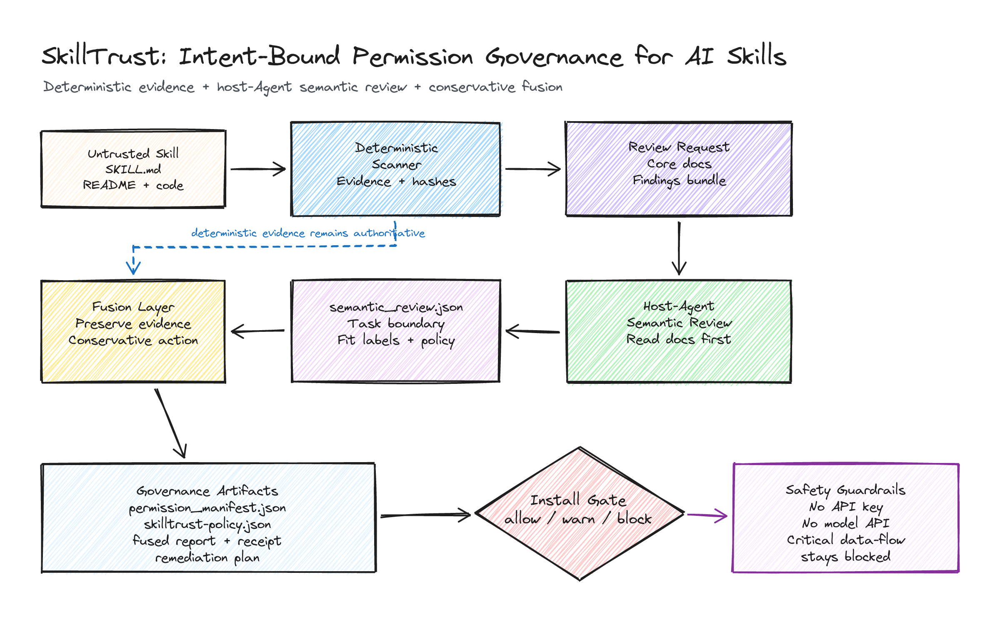
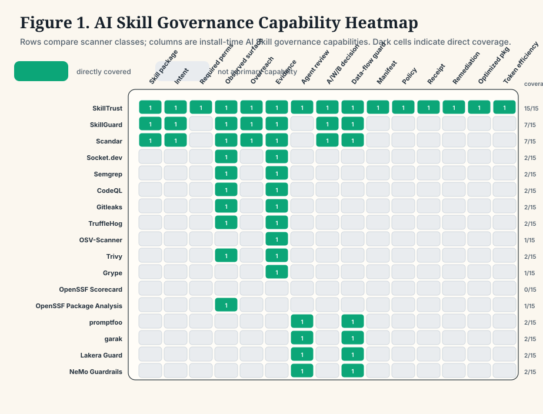
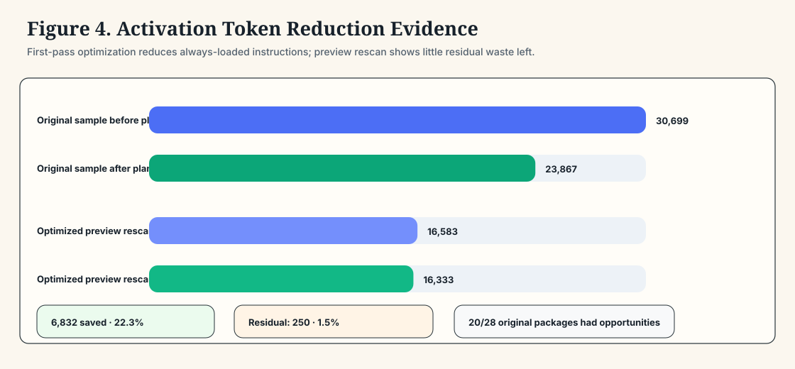

# SkillTrust

[简体中文](README.zh-CN.md) · [Install](#install) · [Use](#use) · [Outputs](#outputs)


**Intent-bound permission governance for AI Skills.**

SkillTrust turns an untrusted AI Skill package into an intent-bound, least-privilege, auditable governance bundle.

Its full product objective is broader than scanning: **upload one Skill, receive an optimized preview Skill**. The optimized Skill should reduce activation tokens, improve execution efficiency by moving deterministic work into code/schema/config, improve Agent selection accuracy through clearer triggers and boundaries, and preserve least-privilege permission governance.

It is not just a scanner asking:

> Is this Skill dangerous?

SkillTrust asks the more useful install-time question:

> What is the minimum permission set required for this Skill to do what it claims, and does its observed behavior exceed that boundary?

## At A Glance



SkillTrust combines two layers:

- **Deterministic evidence**: reproducible findings, file evidence, hashes, permission surfaces, data-flow signals, trust score, policy, and audit receipt.
- **Host-Agent semantic review**: the current Agent reads the Skill's core documents end-to-end and judges whether requested behavior is actually necessary for the declared intent.

The final result is conservative:

- deterministic findings are never deleted
- likely false positives can be marked, but evidence remains visible
- critical sensitive-data-to-network flow cannot be upgraded to safe
- the final install decision is always `allow`, `warn`, or `block`

## Skill Optimization Objective

SkillTrust treats `allow` as the starting line, not the finish line. After a Skill is audited, SkillTrust can produce a unified optimization plan and preview package blueprint:

- **Token savings**: shrink activation-time `SKILL.md` content, defer references, and convert long deterministic instructions into scripts, schemas, or config.
- **Execution efficiency**: replace repeated model reasoning with helper code, validators, routing config, and machine-checkable output contracts.
- **Selection accuracy**: improve names, descriptions, trigger boundaries, and reference navigation so the host Agent chooses the right Skill more reliably.
- **Permission governance**: keep deterministic findings visible, preserve least-privilege manifests, and ship runtime policy gates with the optimized preview.

Run the standalone optimizer:

```bash
python -m skilltrust optimize fixtures/overprivileged-research-skill --out reports/optimized-skill-demo
```

This writes `skill_optimization_plan.json`, `skill_optimization_report.md`, `optimized_SKILL.md`, and `skill_design_guidelines.md`. The guidelines collect high-quality Skill design rules for Agent-assisted optimization. See [Skill Optimization Guidelines](references/08-skill-optimization-guidelines.md).

## What SkillTrust Does

SkillTrust helps answer five questions before using or installing a Skill:

- What does this Skill claim to do?
- What permissions are truly required for that task?
- What filesystem, network, shell, environment, dependency, connector, prompt, or data-flow behavior does it expose?
- Does observed behavior exceed the declared intent?
- How can the Skill be constrained into a safer, auditable, installable package?

It is designed for:

- local AI Skill audits across Codex, Claude Code, Cursor, and other Agent environments
- Skill registry and marketplace review
- install-time permission gates
- enterprise approval workflows
- hackathon and demo judging
- Skill authoring, token efficiency, and taxonomy optimization

## Benchmark Snapshot

SkillTrust was run against 28 representative packages from popular public AI Skill, Claude Skill, Cursor rule, and Agent instruction ecosystems.

Preliminary static benchmark result:

- 24 allow
- 4 warn
- 0 block

The benchmark found no broad malicious pattern in the sampled packages. Its stronger finding is that even high-quality packages benefit from intent-bound governance: connector scopes, user-confirmation gates, semantic false-positive handling, reference splitting, token efficiency, and taxonomy clarity.

See [Popular AI Skill Ecosystem Benchmark](docs/benchmarks/popular-skills-benchmark.md).

Full evaluated sample catalog with source links, download links, and GitHub star counts: [Evaluated Skills Catalog](docs/benchmarks/evaluated-skills-catalog.md). Chinese version: [被评测 Skill 清单](docs/benchmarks/evaluated-skills-catalog.zh-CN.md).

## External Baseline Benchmark

SkillTrust is also benchmarked against 17 well-known security, supply-chain, and LLM guardrail/evaluation baselines, including SkillGuard, Scandar, Socket.dev, Semgrep, CodeQL, Gitleaks, TruffleHog, OSV-Scanner, Trivy, Grype, OpenSSF Scorecard, promptfoo, garak, Lakera Guard, and NeMo Guardrails.

The result is intentionally framed as complementary rather than winner-takes-all:

- SAST, CVE, secret scanning, package behavior analysis, and LLM red-team tools remain valuable for their native tasks.
- SkillTrust covers the install-time AI Skill governance layer: declared intent, least-privilege permission inference, observed/requested permission overreach, conservative Agent semantic fusion, policy artifacts, remediation plans, optimized preview packages, and token-efficiency planning.
- On the three local fixtures, SkillTrust reproduces the expected decisions: benign -> `allow`, overprivileged -> `warn`, malicious-like -> `block`.
- On the original 28-package public sample, SkillTrust's first-pass optimization plan estimates 30,699 -> 23,867 activation-body tokens, saving 6,832 tokens, about 22.3%.
- Re-scanning the 28 optimized preview packages leaves only 250 residual tokens to save, about 1.5%, which acts as a compactness regression check.





See [External Baseline Benchmark](docs/benchmarks/external-baseline-benchmark.md). Chinese version: [外部基线 Benchmark](docs/benchmarks/external-baseline-benchmark.zh-CN.md).

Reproduce:

```bash
PYTHONDONTWRITEBYTECODE=1 python scripts/external_baseline_benchmark.py
```

## Optimized Skill Pack

SkillTrust also includes a public [optimized-skills](optimized-skills/) preview pack. It contains 28 generated Skill packages based on the benchmark sample, each with a compact `SKILL.md`, least-privilege permission manifest, runtime policy overlay, and optimization summary.

These packages show how SkillTrust turns evaluated Skills into more intent-bound, token-efficient, and selection-precise versions. They are not official upstream releases; they are reviewable preview packages for testing.

## Web Demo

SkillTrust now includes a local Web demo for the UCWS Singapore Hackathon 2026 Skill track.

The demo turns the CLI pipeline into an AI governance console:

- upload a `.zip` Skill package or a single `SKILL.md`
- run deterministic intent and permission analysis
- generate `analysis.json`, `trust_report.md`, `permission_manifest.json`, `skilltrust-policy.json`, `audit_receipt.json`, `remediation_plan.md`, `semantic_review_request.json`, and `semantic_review_instructions.md`
- call a Pi-compatible Agent Review Adapter using an OpenAI-compatible MIMO endpoint
- fuse deterministic evidence with Agent semantic judgment
- download an optimized preview Skill zip and the full artifact bundle

### Local Demo

```bash
cd "demo-web"
npm install
npm run dev
```

Then open:

```text
http://localhost:3000
```

### Agent Semantic Review

The local demo does not ship API key configuration files. Semantic review is handled server-side when an operator provides compatible environment variables outside the demo bundle. Otherwise, the demo continues in deterministic-only fallback mode and displays that status in the UI.

### Demo Workflow

1. Upload a Skill package or click one of the built-in fixture buttons.
2. Watch the five-step pipeline: Unpack Skill, Deterministic Evidence, Agent Semantic Review, Policy Fusion, Optimized Package.
3. Review the final `allow`, `warn`, or `block` action, Trust Fit Score, risk level, permission overreach, semantic review summary, policy overlay, and remediation suggestions.
4. Download `optimized-skill.zip`, `artifacts.zip`, or individual reports.

Built-in fixture expectations:

| Fixture | Expected Final Action |
| --- | --- |
| `fixtures/benign-pdf-skill` | `allow` |
| `fixtures/overprivileged-research-skill` | `warn` |
| `fixtures/malicious-like-writing-skill` | `block` |

Screenshot placeholder: local demo screenshots can be captured from `http://localhost:3000`.

Deployed URL placeholder: Local Demo.

## Value Proof: Allow Is Not The Finish Line

SkillTrust also generated optimization plans for the same public sample. The goal is not only to say whether a package is installable, but to make it slimmer, more intent-bound, and easier for an Agent to select precisely:

- 20 / 28 packages had token-saving opportunities.
- Estimated activation-token reduction: 30,699 -> 23,867 tokens.
- Estimated tokens saved: 6,832, about 22.3%.
- 26 scriptification candidates and 17 reference extraction candidates were found.
- 9 taxonomy findings and 7 approval-plan items were generated.
- Selection precision ranking identifies which optimized packages become easier for Agents to choose correctly.


See [SkillTrust Value Proof](docs/benchmarks/value-proof.md). Chinese version: [SkillTrust 价值证明](docs/benchmarks/value-proof.zh-CN.md).

## Install

### Universal One-Prompt Agent Install

Paste this prompt into any local AI Agent, including Codex, Claude Code, Cursor, or another coding Agent:

```text
Install SkillTrust from https://github.com/qybaihe/SkillTrust for the current AI Agent environment. First detect whether this environment is Codex, Claude Code, Cursor, or another local Agent. If the host has a user-level Skills, extensions, rules, or reusable-agent-instructions directory, install SkillTrust there; otherwise install it as a general local tool. Verify that SkillTrust is usable, detect the current Agent's local Skills/extensions/rules root if one exists, then run a read-only first audit of that local Agent package ecosystem. If no local Agent root exists, audit the included demo fixtures and explain how I can pass a target Skill directory. Do not modify, rename, or remediate any existing local Skill, rule, extension, or Agent instruction automatically; only generate reports, policy overlays, and approval plans. After the audit, summarize allow/warn/block counts, dangerous or overprivileged findings, and the next safest remediation steps.
```

This is the recommended installation path because SkillTrust is meant to be used by whichever host Agent is running it. The Agent installs it, verifies it, detects the local Agent package root when available, audits the local Skill or instruction ecosystem, and keeps all real packages unchanged unless you explicitly approve follow-up edits.

### After Installation

Ask your Agent:

```text
Use SkillTrust to run a read-only audit of my local AI Agent Skills, rules, extensions, or reusable instructions, and tell me which ones are overprivileged, dangerous, ambiguous, or worth optimizing.
```

## Use

SkillTrust is meant to be used through natural-language requests to your Agent. Copy one of these prompts.

### Audit All Local Agent Packages

```text
Use SkillTrust to audit all local AI Agent Skills, rules, extensions, and reusable instructions in this environment. Keep the audit read-only. Tell me which packages are allow, warn, or block, and highlight the most important permission overreach, dangerous data-flow, ambiguity, and optimization findings.
```

### Audit One Skill

```text
Use SkillTrust to audit this Skill or Agent package: <paste the path, repository, or folder here>. Explain what it claims to do, what permissions it really needs, what behavior it exposes, whether anything exceeds its intent, and whether I should allow, warn, or block it.
```

### Check Before Installing

```text
Use SkillTrust as an install-time gate for this Skill package: <paste the path, repository, or folder here>. Give me a clear allow, warn, or block decision, and explain the evidence behind it.
```

### Generate A Reviewable Remediation Plan

```text
Use SkillTrust to create a reviewable remediation plan for this Skill package: <paste the path, repository, or folder here>. Do not modify the original package. Generate the least-privilege policy overlay, narrowed permission recommendations, and the safest next edits for me to approve.
```

### Add Host-Agent Semantic Review

```text
Use SkillTrust's host-Agent semantic review for this Skill package: <paste the path, repository, or folder here>. First read the core documents fully, then compare declared intent against observed behavior, preserve deterministic evidence, and produce the fused trust decision.
```

SkillTrust does **not** call OpenAI, Anthropic, or any external model API. No API key is required. The semantic reviewer is the Agent already running SkillTrust.

### Optimize Skill Quality

```text
Use SkillTrust to review this Skill ecosystem for authoring quality, token efficiency, and taxonomy clarity. Keep all changes as recommendations or approval plans unless I explicitly approve edits.
```

### Generate An Optimized Skill Preview

```text
Use SkillTrust to optimize this Skill package into a preview Skill. Preserve deterministic findings, reduce activation tokens, move deterministic procedures into scripts or schemas, improve trigger accuracy, and keep the generated permission policy in the package.
```

## Outputs

SkillTrust can generate:

- `permission_manifest.json`: least-privilege permission model inferred from declared intent
- `skilltrust-policy.json`: policy overlay for filesystem, network, environment, shell, connector, dependency, prompt, and semantic constraints
- `trust_report.md`: human-readable deterministic trust report
- `fused_trust_report.md`: deterministic evidence plus host-Agent semantic review
- `audit_receipt.json`: reproducible audit receipt with hashes and rule metadata
- `remediation_plan.md`: concrete steps to converge the Skill to least privilege
- `install_decision.json`: install-time `allow`, `warn`, or `block`
- `local_skills_report.md`: local Skill portfolio dashboard
- `authoring_report.md`: Skill harness and reference-splitting recommendations
- `token_efficiency_report.md`: token waste and scriptification opportunities
- `skill_taxonomy_report.md`: naming, description, and routing ambiguity findings
- `skill_optimization_plan.json`: unified token, execution, selection, and permission optimization plan
- `skill_optimization_report.md`: human-readable optimized Skill preview plan
- `skill_design_guidelines.md`: Agent-readable rules for optimizing Skill authoring quality

## Trust Fit Score

SkillTrust scores packages from 0 to 100:

| Score | Level |
| ---: | --- |
| 85-100 | Trusted |
| 70-84 | Mostly Trusted |
| 50-69 | Needs Review |
| 30-49 | Overprivileged |
| 0-29 | Critical Risk |

The score considers intent clarity, permission necessity, overreach, sensitive surfaces, data-flow safety, install-time safety, prompt integrity, enforceability, and auditability.

## Safety Boundaries

- SkillTrust performs static analysis by default.
- It does not execute target Skills.
- It does not call external model APIs.
- It does not require API keys.
- It preserves deterministic evidence during semantic fusion.
- It keeps local Skill remediation and rename actions pending user approval.
- Real local audit reports may contain local paths or private evidence, so avoid publishing them directly.

## Demo Fixtures

| Fixture | Declared Intent | Score | Risk Level | Install Gate |
| --- | --- | ---: | --- | --- |
| `fixtures/benign-pdf-skill` | PDF summarization | 100 | Trusted | allow |
| `fixtures/overprivileged-research-skill` | Research/reporting | 45 | Overprivileged | warn |
| `fixtures/malicious-like-writing-skill` | Writing assistant | 25 | Critical Risk | block |

These fixtures show the difference between a benign Skill, a good-intent but overprivileged Skill, and a malicious-like Skill with sensitive data flow.

## Core Narrative

SkillTrust is not a keyword scanner. It is an install-time trust layer for AI Skills:

> SkillTrust combines reproducible evidence with host-Agent semantic permission reasoning to make AI Skills installable with intent-bound trust.
