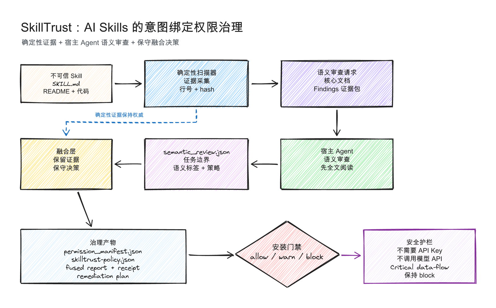
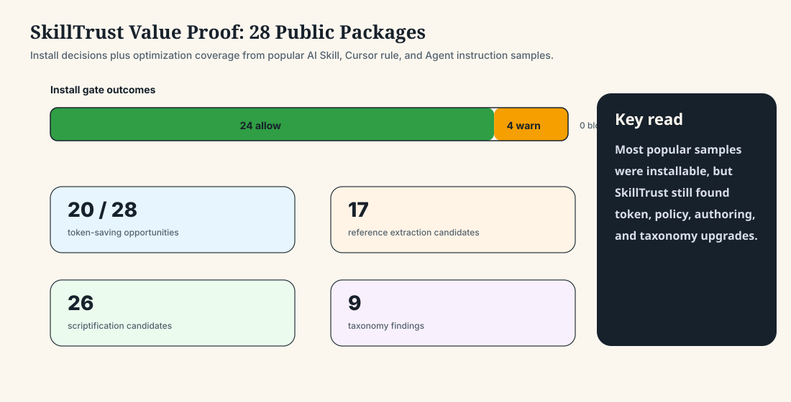
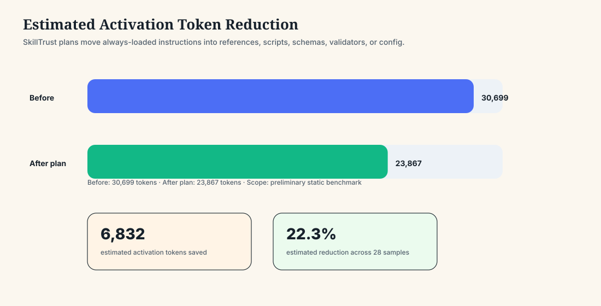
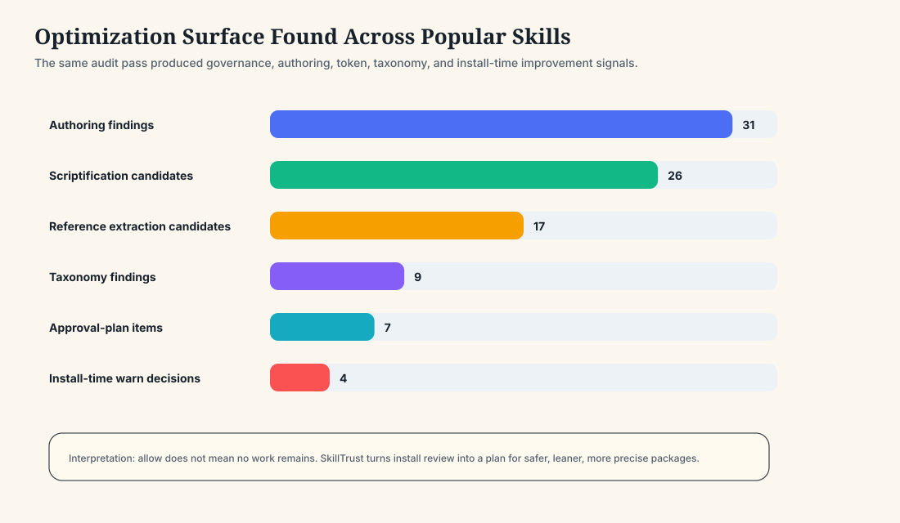
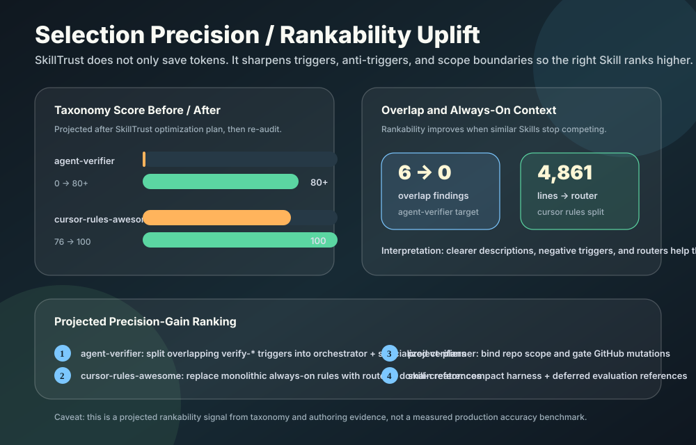

# SkillTrust

[English](README.md) · [安装](#安装) · [使用](#使用) · [输出](#输出)


**面向 AI Skills 的意图绑定权限治理层。**

SkillTrust 可以把一个不可信的 AI Skill 包转换成：意图绑定、最小权限、可审计的治理包。

它不是只问：

> 这个 Skill 危不危险？

SkillTrust 问的是更适合安装前判断的问题：

> 这个 Skill 要完成它声称的任务，最少需要哪些权限？它实际暴露的行为是否超过了这个边界？

## 一图看懂



SkillTrust 结合两层判断：

- **确定性证据**：可复现 findings、文件证据、hash、权限面、数据流信号、信任评分、policy 和 audit receipt。
- **宿主 Agent 语义审查**：当前运行 SkillTrust 的 Agent 先全文阅读 Skill 核心文档，再判断这些权限和行为是否真的符合声明意图。

最终决策是保守的：

- deterministic findings 不会被删除
- likely false positive 可以被标注，但证据仍然保留
- critical sensitive-data-to-network flow 不能被语义审查洗成安全
- 最终安装决策始终是 `allow`、`warn` 或 `block`

## SkillTrust 是做什么的

SkillTrust 用来在使用或安装 Skill 前回答五个问题：

- 这个 Skill 声称要做什么？
- 完成这个任务真正需要哪些权限？
- 它实际暴露了哪些 filesystem、network、shell、environment、dependency、connector、prompt 或 data-flow 行为？
- 实际行为是否超出了声明意图？
- 如何把它收敛成更安全、可审计、可安装的 Skill？

它适合：

- Codex、Claude Code、Cursor 等本地 AI Agent 的 Skills / rules / extensions 安全审计
- Skill registry / marketplace 审查
- 安装前权限门禁
- 企业内部审批流程
- 比赛与 demo 展示
- Skill 编写质量、token 效率和 taxonomy 优化

## Benchmark Snapshot

SkillTrust 已对 28 个来自热门公开 AI Skill、Claude Skill、Cursor rules 和 Agent instruction 生态的代表性 package 做过初步静态 benchmark。

初步结果：

- 24 allow
- 4 warn
- 0 block

这次 benchmark 没有把重点放在“证明别人危险”，而是证明：即使是高质量 package，也常常可以继续优化 intent-bound governance，例如 connector scope、用户确认门禁、语义误报处理、references 拆分、token 效率和 taxonomy 清晰度。

查看报告：[Popular AI Skill Ecosystem Benchmark](docs/benchmarks/popular-skills-benchmark.md)。

完整被评测样本清单、来源链接、下载链接和 GitHub Stars：[被评测 Skill 清单](docs/benchmarks/evaluated-skills-catalog.zh-CN.md)。英文版：[Evaluated Skills Catalog](docs/benchmarks/evaluated-skills-catalog.md)。

## Value Proof：Allow 不是终点

SkillTrust 也为同一批公开样本生成了优化计划。重点不是只判断能不能安装，而是把 package 变得更精简、更受意图约束，也更容易被 Agent 精准选择：

- 20 / 28 个 package 有 token-saving 机会。
- 预计 activation-token reduction：30,699 -> 23,867 tokens。
- 预计节省 6,832 tokens，约 22.3%。
- 发现 26 个 scriptification candidates 和 17 个 reference extraction candidates。
- 生成 9 个 taxonomy findings 和 7 个 approval-plan items。
- 增加 selection precision ranking，用来说明哪些优化后的 Skill 更容易被 Agent 精准选中。









查看中文报告：[SkillTrust 价值证明](docs/benchmarks/value-proof.zh-CN.md)。英文版：[SkillTrust Value Proof](docs/benchmarks/value-proof.md)。

## 安装

### 通用一句话交给 AI Agent 安装

把下面这段提示词发给任意本地 AI Agent，例如 Codex、Claude Code、Cursor 或其他 coding Agent：

```text
请把 SkillTrust 从 https://github.com/qybaihe/SkillTrust 安装到当前 AI Agent 环境中。先识别当前环境是 Codex、Claude Code、Cursor 还是其他本地 Agent。如果宿主环境有用户级 Skills、extensions、rules 或 reusable-agent-instructions 目录，就把 SkillTrust 安装到那里；如果没有专用目录，就把它安装成通用本地工具。请验证 SkillTrust 已可使用，然后识别当前 Agent 的本地 Skills/extensions/rules 根目录；如果存在，请对这个本地 Agent package 生态做一次只读首次审计。如果不存在本地 Agent 根目录，请审计仓库内置 demo fixtures，并说明我如何传入目标 Skill 目录。不要自动修改、重命名或修复任何现有本地 Skill、rule、extension 或 Agent instruction，只生成报告、policy overlay 和需要用户审批的计划。最后请总结 allow/warn/block 数量、危险或越权 findings，以及下一步最安全的 remediation 建议。
```

这是推荐安装方式，因为 SkillTrust 本来就是给宿主 Agent 使用的。Agent 会完成安装、验证、识别当前环境的本地包目录、审计 Skill 或 instructions 生态，并且在你明确批准之前不会改动任何真实包。

### 安装后使用

对 Agent 说：

```text
请使用 SkillTrust 对我的本地 AI Agent Skills、rules、extensions 或 reusable instructions 做一次只读审计，告诉我哪些可能越权、危险、歧义，或者值得优化。
```

## 使用

SkillTrust 的使用方式就是直接对 Agent 说自然语言。你可以复制下面这些提示词。

### 审计所有本地 Agent packages

```text
请使用 SkillTrust 审计当前环境里的所有本地 AI Agent Skills、rules、extensions 和 reusable instructions。保持只读，不要修改任何内容。请告诉我哪些 package 是 allow、warn 或 block，并重点列出权限越界、危险数据流、命名歧义和可优化项。
```

### 审计单个 Skill

```text
请使用 SkillTrust 审计这个 Skill 或 Agent package：<把路径、仓库地址或文件夹放在这里>。请说明它声称要做什么、真正需要什么权限、实际暴露了什么行为、有没有超出意图边界，以及我应该 allow、warn 还是 block。
```

### 安装前门禁

```text
请用 SkillTrust 对这个 Skill package 做安装前门禁检查：<把路径、仓库地址或文件夹放在这里>。请给出明确的 allow、warn 或 block 决策，并解释关键证据。
```

### 生成可审查的修复计划

```text
请使用 SkillTrust 为这个 Skill package 生成可审查的修复计划：<把路径、仓库地址或文件夹放在这里>。不要修改原始 package，只生成最小权限 policy overlay、权限收敛建议和需要我审批的下一步修改。
```

### 加入宿主 Agent 语义审查

```text
请使用 SkillTrust 的宿主 Agent 语义审查来审计这个 Skill package：<把路径、仓库地址或文件夹放在这里>。请先完整阅读核心文档，再比较声明意图和实际行为，保留确定性证据，并输出融合后的信任决策。
```

SkillTrust **不调用 OpenAI、Anthropic 或任何外部模型 API**，也**不需要 API Key**。语义审查者就是当前运行 SkillTrust 的宿主 Agent。

### 优化 Skill 质量

```text
请使用 SkillTrust 审查这个 Skill 生态的编写质量、token 效率和 taxonomy 清晰度。除非我明确批准修改，否则所有结果只生成建议或审批计划。
```

## 输出

SkillTrust 可以生成：

- `permission_manifest.json`：根据声明意图推断的最小权限模型
- `skilltrust-policy.json`：filesystem、network、environment、shell、connector、dependency、prompt 和 semantic 约束策略
- `trust_report.md`：确定性审计报告
- `fused_trust_report.md`：融合宿主 Agent 语义审查后的报告
- `audit_receipt.json`：包含 hash 和规则版本的可复现审计凭证
- `remediation_plan.md`：把 Skill 收敛到最小权限的具体建议
- `install_decision.json`：安装前 `allow`、`warn` 或 `block`
- `local_skills_report.md`：本地 Skill 组合审计总览
- `authoring_report.md`：Skill harness 和 references 拆分建议
- `token_efficiency_report.md`：token 浪费和 scriptification 优化机会
- `skill_taxonomy_report.md`：命名、description 和路由歧义 findings

## Trust Fit Score

SkillTrust 使用 0 到 100 分：

| 分数 | 等级 |
| ---: | --- |
| 85-100 | Trusted |
| 70-84 | Mostly Trusted |
| 50-69 | Needs Review |
| 30-49 | Overprivileged |
| 0-29 | Critical Risk |

评分会考虑声明意图清晰度、权限必要性、越权程度、敏感面、数据流安全、安装时风险、prompt integrity、可执行性和可审计性。

## 安全边界

- 默认进行静态分析。
- 不执行目标 Skill。
- 不调用外部模型 API。
- 不需要 API Key。
- semantic fusion 会保留 deterministic evidence。
- 对本地 Skill 的修复、重命名和描述更新默认只生成审批计划。
- 本地审计报告可能包含本地路径或私有 evidence，不建议直接公开。

## Demo Fixtures

| Fixture | 声明意图 | 分数 | 风险等级 | 安装门禁 |
| --- | --- | ---: | --- | --- |
| `fixtures/benign-pdf-skill` | PDF summarization | 100 | Trusted | allow |
| `fixtures/overprivileged-research-skill` | Research/reporting | 45 | Overprivileged | warn |
| `fixtures/malicious-like-writing-skill` | Writing assistant | 25 | Critical Risk | block |

这些 fixtures 展示了低风险 Skill、初衷合理但权限过大的 Skill，以及存在敏感数据流的 malicious-like Skill。

## 核心叙事

SkillTrust 不是关键词 scanner，而是 AI Skills 的安装前信任治理层：

> SkillTrust combines reproducible evidence with host-Agent semantic permission reasoning to make AI Skills installable with intent-bound trust.
