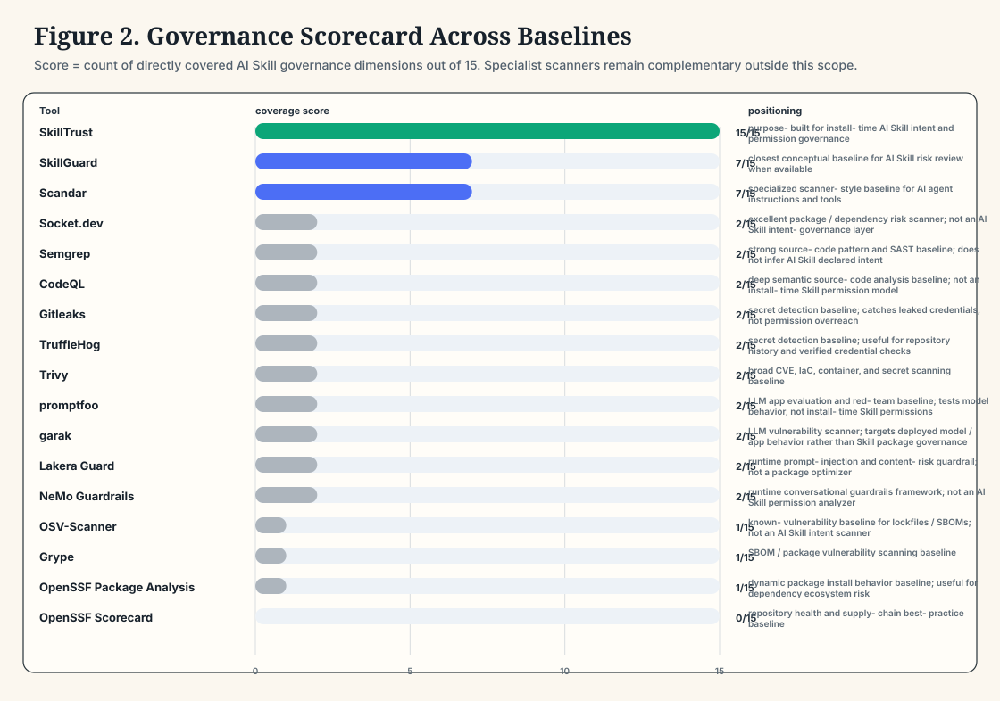
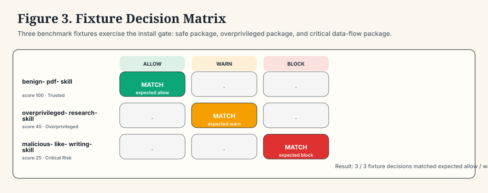

# 外部基线 Benchmark

日期：2026-06-08

这份 benchmark 将 SkillTrust 与主流安全扫描、供应链安全、LLM guardrail / eval 工具放在一起比较。它不是要证明 SkillTrust 替代这些工具，而是说明 SkillTrust 补上的那一层：面向 AI Skill package 的安装前意图绑定权限治理，以及可以减少常驻 Skill token 的优化建议。

英文版：[External Baseline Benchmark](external-baseline-benchmark.md)。

## 核心结果

- 对比工具数：17
- SkillTrust 覆盖的 Skill 治理能力：15 / 15
- 外部基线在这些 Skill 治理维度上的最高覆盖：7 / 15
- Fixture 安装决策命中预期：3 / 3
- 已测优化版 Skill 包：28
- 原始 28 包公开样本第一轮 activation-token reduction：30699 -> 23867，节省 6832 tokens（22.3%）
- 优化预览包复扫：只剩 250 个可继续节省的 residual tokens（1.5%），说明 preview pack 已经明显变精简

## 图表







## Fixture 决策 Benchmark

| Fixture | 场景 | 预期 | SkillTrust | 分数 | 风险等级 | Findings | Token 节省 |
| --- | --- | --- | --- | ---: | --- | ---: | ---: |
| `benign-pdf-skill` | 低风险 PDF 摘要 Skill，只需要本地文件处理 | `allow` | `allow` | 100 | Trusted | 0 | 0 |
| `overprivileged-research-skill` | 研究类 Skill 请求了超过声明意图所需的 network、home、shell、credential 权限面 | `warn` | `warn` | 45 | Overprivileged | 5 | 0 |
| `malicious-like-writing-skill` | 写作类 fixture 暴露了本地敏感凭证到网络出口的数据流形态 | `block` | `block` | 25 | Critical Risk | 6 | 0 |

## 能力矩阵

说明：`yes` 表示这是该工具类别直接覆盖的能力；`partial` 表示可以贡献证据，但不会生成 SkillTrust 风格的治理产物或安装决策；`no` 表示不属于该工具主要范围。

| 工具 | 类别 | 本地状态 | Skill 包 | 意图 | 越界 | Agent 审查 | 决策 | Policy | 优化包 | Token 节省 | 说明 |
| --- | --- | --- | --- | --- | --- | --- | --- | --- | --- | --- | --- |
| SkillTrust | AI Skill governance | available | yes | yes | yes | yes | yes | yes | yes | yes | purpose-built for install-time AI Skill intent and permission governance |
| SkillGuard | AI Skill / agent safety research | not_run | yes | yes | yes | no | yes | no | no | no | closest conceptual baseline for AI Skill risk review when available |
| Scandar | AI agent / Skill scanner | not_run | yes | yes | yes | no | yes | no | no | no | specialized scanner-style baseline for AI agent instructions and tools |
| [Socket.dev](https://docs.socket.dev/) | software supply-chain security | not_installed | no | no | no | no | no | no | no | no | excellent package/dependency risk scanner; not an AI Skill intent-governance layer |
| [Semgrep](https://docs.semgrep.dev/) | SAST | not_installed | no | no | no | no | no | no | no | no | strong source-code pattern and SAST baseline; does not infer AI Skill declared intent |
| [CodeQL](https://docs.github.com/en/code-security/code-scanning/introduction-to-code-scanning/about-code-scanning-with-codeql) | semantic code analysis | not_installed | no | no | no | no | no | no | no | no | deep semantic source-code analysis baseline; not an install-time Skill permission model |
| [Gitleaks](https://github.com/gitleaks/gitleaks) | secret scanning | not_installed | no | no | no | no | no | no | no | no | secret detection baseline; catches leaked credentials, not permission overreach |
| [TruffleHog](https://github.com/trufflesecurity/trufflehog) | secret scanning | not_installed | no | no | no | no | no | no | no | no | secret detection baseline; useful for repository history and verified credential checks |
| [OSV-Scanner](https://google.github.io/osv-scanner/) | dependency vulnerability scanning | not_installed | no | no | no | no | no | no | no | no | known-vulnerability baseline for lockfiles/SBOMs; not an AI Skill intent scanner |
| [Trivy](https://trivy.dev/) | vulnerability / misconfiguration scanning | not_installed | no | no | no | no | no | no | no | no | broad CVE, IaC, container, and secret scanning baseline |
| [Grype](https://github.com/anchore/grype) | vulnerability scanning | not_installed | no | no | no | no | no | no | no | no | SBOM/package vulnerability scanning baseline |
| [OpenSSF Scorecard](https://github.com/ossf/scorecard) | project security posture | not_installed | no | no | no | no | no | no | no | no | repository health and supply-chain best-practice baseline |
| OpenSSF Package Analysis | dynamic package behavior analysis | not_run | no | no | no | no | no | no | no | no | dynamic package install behavior baseline; useful for dependency ecosystem risk |
| [promptfoo](https://www.promptfoo.dev/docs/intro/) | LLM red teaming / evals | not_installed | no | no | no | yes | no | no | no | no | LLM app evaluation and red-team baseline; tests model behavior, not install-time Skill permissions |
| [garak](https://github.com/NVIDIA/garak) | LLM vulnerability scanning | not_installed | no | no | no | yes | no | no | no | no | LLM vulnerability scanner; targets deployed model/app behavior rather than Skill package governance |
| [Lakera Guard](https://www.lakera.ai/guard) | LLM security guardrail | not_run | no | no | no | yes | no | no | no | no | runtime prompt-injection and content-risk guardrail; not a package optimizer |
| [NeMo Guardrails](https://docs.nvidia.com/nemo/guardrails/latest/index.html) | LLM guardrails framework | not_installed | no | no | no | yes | no | no | no | no | runtime conversational guardrails framework; not an AI Skill permission analyzer |

## 详细治理维度

| 能力 | SkillTrust | 外部基线 | 对 AI Skills 的意义 |
| --- | --- | --- | --- |
| AI Skill 包 | yes | SkillGuard、Scandar | 审查对象是可复用 AI Skill package，而不只是代码仓库或依赖图。 |
| 声明意图 | yes | SkillGuard、Scandar | Skill 需要按照它声称要做的事情来判断。 |
| 必要权限推断 | yes | 无直接覆盖 | 最小权限治理需要推断完成该意图真正需要的权限集合。 |
| 实际权限面 | yes | SkillGuard、Scandar、Socket.dev、Semgrep、CodeQL 等 | filesystem、shell、environment、network、connector、dependency、prompt 权限面必须可见。 |
| 意图与权限越界 | yes | SkillGuard、Scandar | 核心问题是实际/请求权限是否超出声明意图。 |
| 行级证据 | yes | SkillGuard、Scandar、Socket.dev、Semgrep、CodeQL 等 | 审查者需要可复现证据，而不只是一个分数。 |
| Agent 语义审查 | yes | promptfoo、garak、Lakera Guard、NeMo Guardrails | 宿主 Agent 可以阅读全文与示例，标注 likely false positive，但不能删除证据。 |
| allow/warn/block 决策 | yes | SkillGuard、Scandar | 安装前门禁需要保守的动作输出。 |
| 关键数据流保护 | yes | SkillGuard、Scandar、promptfoo、garak、Lakera Guard 等 | 敏感本地数据流向网络出口不能被语义审查洗成安全。 |
| 权限清单 | yes | 无直接覆盖 | 审查结果应生成可安装的最小权限契约。 |
| 策略覆盖层 | yes | 无直接覆盖 | Policy overlay 可以让宿主 runtime 展示或执行边界。 |
| 审计凭证 | yes | 无直接覆盖 | 审计凭证用 hash 和规则版本支持复现。 |
| 修复计划 | yes | 无直接覆盖 | 治理结果应该告诉用户如何收敛到最小权限。 |
| 优化版 Skill 包 | yes | 无直接覆盖 | SkillTrust 可以生成优化预览包，而不只是 findings 列表。 |
| Token 效率 | yes | 无直接覆盖 | 把确定性细节从常驻指令移出，可以降低激活上下文成本。 |

## Token 节省 Benchmark

这个仓库里有两组 token-efficiency 数字：

- 原始公开样本：`30699` -> `23867` estimated activation-body tokens，预计节省 `6832` tokens（`22.3%`）。
- 优化预览包复扫：`16583` -> `16333` estimated activation-body tokens，只剩 `250` residual tokens 可继续节省（`1.5%`）。

第一组数字展示产品价值：SkillTrust 能在原始 package 里发现 token 浪费。第二组数字是回归检查：SkillTrust 生成优化版 preview package 后，常驻 token 浪费已经明显降低。

- 原始样本中有 token-saving 机会的 Skills：20 / 28
- 原始 scriptification candidates：26
- 原始 reference extraction candidates：17
- 优化预览包复扫后仍有剩余 token-saving 机会的 Skills：5 / 28
- 复扫后剩余 scriptification / config candidates：5

优化预览包复扫后的 residual 机会：

| Skill | Activation Tokens | 预计节省 | Token Score |
| --- | ---: | ---: | ---: |
| `compliance-checker` | 587 | 50 | 91 |
| `verify-language` | 568 | 50 | 91 |
| `verify-patterns` | 540 | 50 | 91 |
| `verify-quality` | 554 | 50 | 91 |
| `verify-security` | 560 | 50 | 91 |

## 如何解读

- SAST、CVE、secret scanning、package behavior analysis、LLM red-team 工具仍然很有价值，它们是 SkillTrust 的互补层。
- SkillTrust 的差异化位置是 AI Skill 安装边界：声明意图、最小权限推断、越界检测、与 Agent 语义审查保守融合、policy 产物、修复计划和优化预览包。
- Token 节省是 activation-context 估算，不是生产计费承诺。但它对 Skill 很重要，因为很多 Skill 在真正用到任务细节前，就会先加载大量常驻指令。

## 复现方式

```bash
PYTHONDONTWRITEBYTECODE=1 python scripts/external_baseline_benchmark.py
```

该命令会重新生成：

- `docs/benchmarks/external-baseline-results.json`
- `docs/benchmarks/external-baseline-benchmark.md`
- `docs/benchmarks/external-baseline-benchmark.zh-CN.md`
- `docs/assets/external-baseline-*.svg`

## 限制说明

- 外部工具不会被脚本强制联网安装；如果本地没有 CLI，就标记为 `not_installed` 或 `not_run`。
- 对专业扫描器的安全强弱判断，应该在它们各自原生任务上单独评估。
- SkillTrust 的 benchmark 结论限定在 AI Skill package 治理与 token-efficiency planning。
